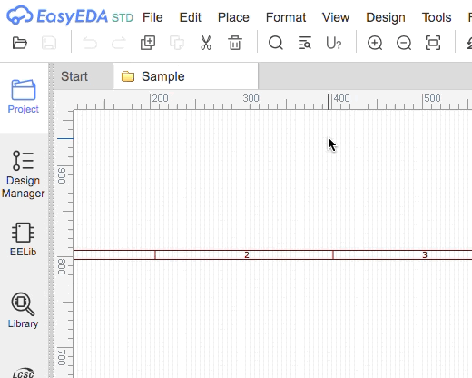
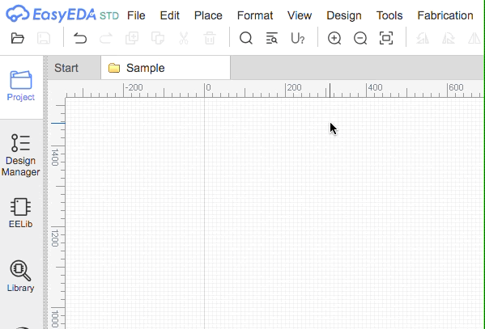

# easyeda-extension-menu-ux-normalizer

[EasyEDA: Desiger](https://easyeda.com/editor) has a really annoying issue with sub-menus popping up when mouse is hovered over main menu's items. This extension is build in order to fix the issue by blocking main menu's `hover behaviour`.

#### 🤬 - Default behaviour without extension:

#### ✅ - After installing this extension:

## Installation

1. Download [easyeda-extension-menu-ux-normalizer.zip](https://github.com/turbobabr/easyeda-extension-menu-ux-normalizer/archive/main.zip) archive.
2. Unzip the downloaded file.
3. Open [EasyEDA: Designer](https://easyeda.com/editor).
4. Via main menu, go to `Advanced -> Extensions`.
5. Click on `Load Extensions...` button.
6. Load files located in the `extension` sub folder of the unpacked archive you have just downloaded by clicking on `Select Files..` button.
7. In the `Extension ID` filed put `fixmenu` string and hit `Load Extension` button.
8. Finally, refresh the page in the browser to make it working.

## Usage

After the installation process - you don't need to run any commands or perform any actions to make it working. The extension itself is initialized during the `EasyEDA` startup automatically.

## Feedback

If you discover any issue or have any suggestions for improvement of the plugin, please [open an issue](https://github.com/turbobabr/easyeda-extension-menu-ux-normalizer/issues) or ping me on twitter [@turbobabr](http://twitter.com/turbobabr).

